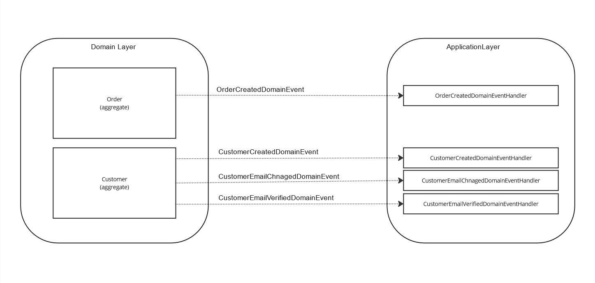
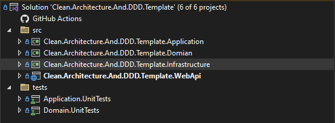
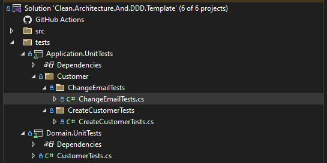

# Clean Architecture and Domain Driven Design Template 

This is a template for creating your own application using **Clean Architecture**, utilizing **building blocks from Domain-Driven Design**. Read and write operations have been separated according to the **CQRS** pattern. 
System observability is ensured by the implementation of OpenTelemetry and the Aspire Dashboard.
Additionally, you'll find implementations of design patterns such as mediator, factory, strategy, and several others.

The implementation of business domain logic is kept to a minimum. Selected use cases were implemented to demonstrate communication between layers and the use of domain and integration events.

This project is undergoing rapid development, with new features being added frequently. Stay updated and click Watch button, click ⭐ if you find it useful.

## Table of contents

* [1. Instalation](#1-Installation) 
    * [1.1 Solution Template Installation](#11-Solution-Template-Installation) 
    * [1.2 Database](#12-Database)
    * [1.3 Docker](#13-Docker)
* [2. Introduction](#2-Introduction)
    * [2.1 Motivation](#21-Motivation) 
* [3. Domain](#3-Domain)
    * [3.1 Introduction](#31-Introduction)
    * [3.2 Aggregates](#32-Aggregates)
    * [3.3 Domain Events](#33-Domain-Events) 
* [4. Architecture](#4-Architecture)
    * [4.1 Clean Architecure](#41-Clean-Architecure)
        * [4.1.1 Presentation Layer](#411-Presentation-Layer)
        * [4.1.2 Infrastructure Layer](#412-Infrastructure-Layer)
        * [4.1.3 Application Layer](#413-Application-Layer)
        * [4.1.4 Domain Layer](#414-Domain-Layer)
    * [4.2 Eventual consistency](#42-Eventual-consistency)
        * [4.2.1 Domain Events](#421-Domain-Events)
        * [4.2.2 Integration Events](#422-Integration-Events)
    * [4.3 Command Query Responsibility Segregation (CQRS)](#43-Command-Query-Responsibility-Segregation-(CQRS))
    * [4.4 Cross Cutting Concerns](#44-Cross-Cutting-Concerns)
* [5. Observability](#5-Observability)
* [6. Design patterns implemented in this project](#6-Design-patterns-implemented-in-this-project)
    * [6.1 Mediator](#61-Mediator)
    * [6.2 Factory method](#62-Factory-Method)
    * [6.3 Strategy](#63-Strategy)
* [7. Tests](#7-Tests)
    * [7.1 Domain tests](#71-Domain-tests)
    * [7.2 Application tests](#72-Application-tests)


## 1. Installation
I do recommend using CLI instead Visual Studnio Wizard when creating your application based on this template because Vistual Studio doesn't keep folders structure correctly.

### 1.1 Solution Template Installation
First and foremost, install this template on your system to be able to create applications based on it.
```
dotnet new install Clean.Architecture.And.DDD.Template::1.0.2
```
Once installed type. (Replace the phrase 'MyDreamProject' with the name of your project.)
```
dotnet new ca-and-ddd -o "MyDreamProject"
```

### 1.2 Database

The template uses MSSQL as a database provider. Migrations will be applied automatically during project startup, so you don't have to do anything.

### 1.3 Docker

As a result of running command from step 1.1 all files and folders will be created. Among them you will find docker-compose.yaml.
Simply run the command 'docker-compose up' to create required containers.
docker-compose.yaml provides instances of: MSSQL, Redis, RabbitMQ, and Aspire Dashboard. 

### 1.4 Database migrations

In case you need to add a new migration, just navigate to the src/ directory and run. 
(Please remember to replace "Clean.Architecture.And.DDD.Template" with you project name).

```
dotnet ef migrations add "Migration name" --context "AppDbContext" --project .\Clean.Architecture.And.DDD.Template.Infrastructure\ --startup-project .\Clean.Architecture.And.DDD.Template.WebApi\
```

## 2. Introduction

### 2.1 Motivation

I couldn't find any repository that met the following criteria:

1. Implemented Mediator pattern **using MassTransit library instead of MediatR** with added message interception support (similar to IPipelineBehaviour in MediatR).
2. Implemented system observability using Open Telemetry.
3. Implemented Domain Events as part of Eventual Consistency, so Domain Events are not published in the same transaction as saving/updating Aggregate.

Even when encountering projects that fulfilled one of these points, they often conflicted with others or omitted them entirely. Therefore, I decided to create a project that meets the above criteria. I am sharing it in case someone else is looking for something similar.

## 3. Domain

### 3.1 Introduction
The e-commerce domain was deliberately chosen because it is widely known and understood. This template consists of two aggregates: Customer and Order.
I decided to extend the domain just enough to utilize all the building blocks, but nothing more. The goal of this repository is to create a template that provides an example implementation.
Keeping things simple in the Domain layer allows you to focus on understanding complex topics, such as the building blocks of the Domain-Driven Design approach.

### 3.2 Aggregates

There are two aggregates in the Domain Layer. These are:

**Customer** – This is the most important aggregate in our layer because it is responsible for placing orders. In other words, this is the entity that starts the process of placing orders. Besides placing orders, the customer can also change their e-mail address and verify it.

**Order** – This represents a particular order. It has a list of order items, along with their price, quantity, etc.

### 3.3 Domain Events

Domain events allow informing other parts of the application about changes that have occurred within our domain. They are an excellent way to implement business processes in a loosely coupled manner. Each domain event represents a specific action adhering to the [(Single Responsibility Principle, SRP)](https://en.wikipedia.org/wiki/Single-responsibility_principle) that has happened in the system; therefore, event names are represented in the past tense, e.g., OrderCreatedDomainEvent. When a domain event is published, all interested parties can react to it. As the number of "interested parties" for a given domain event grows, all that needs to be done is to create an additional handler to perform extra logic. This approach also aligns with the [Open/Closed Principle](https://en.wikipedia.org/wiki/Open%E2%80%93closed_principle).

In our solution, domain events are stored in the database within the same transaction as the aggregate's save operation. This means they are not dispatched immediately but only after the aggregate has been successfully saved. Once this happens, the DomainEventsProcessor retrieves the events from the database and publishes them.

For example: When a Customer places an order, an event called OrderCreatedDomainEvent is stored in the database and then retrieved and published by the DomainEventsProcessor. An event handler, OrderCreatedDomainEventHandler, listens for this event and handles sending an email to the customer who placed the order. Implementing the business process in this way allows for leveraging the eventual consistency approach.

The diagram above shows all implemented Domain Events and their respective handlers.



Dispatching domain events within the same transaction or outside of it is a sticking point in the community. You can find various implementations on the web.

Outside transaction: [ardalis/CleanArchitecture](https://github.com/ardalis/CleanArchitecture/blob/main/src/Clean.Architecture.Infrastructure/Data/AppDbContext.cs)
During transaction: [jasontaylordev/CleanArchitecture](https://github.com/jasontaylordev/CleanArchitecture/blob/main/src/Infrastructure/Data/Interceptors/DispatchDomainEventsInterceptor.cs)


## 4. Architecture

### 4.1 Clean Architecure

By applying the Clean Architecture approach, we achieved a separation of the application into layers that are independent of each other, making them easy to test. The project consists of four layers, as shown in the image below.



#### 4.1.1 Presentation Layer

The presentation layer (in our case, simply a [RESTful API](https://en.wikipedia.org/wiki/REST)) is responsible for interacting with users by receiving and processing HTTP requests. It performs validation of commands and queries, and then communicates directly with the application layer to handle the request.

#### 4.1.2 Infrastructure Layer

The Infrastructure layer is responsible for implementing technical aspects such as database access and broad integrations with external systems. This layer is also responsible for implementing interfaces defined in the domain and application layers.
The Infrastructure layer referances the Application layer. 

#### 4.1.3 Application Layer

This layer orchestrates processes in the application. The Application Layer only references the Domain Layer. Most of the application logic resides in command handlers, where you can implement specific scenarios (use cases).

#### 4.1.4 Domain Layer

This is the most important layer, as it contains business logic and implements business processes. It consists of aggregates, value objects, domain services, and other domain-related elements. This layer is the heart of the whole system. The domain layer is completely independent; it does not reference other layers and does not depend on any external libraries, making it very easy to test and maintain.

### 4.2 Eventual consistency

### 4.2.1 Domain Events
Saving and publishing domain events only after the aggregate has been saved means that we must use the approach known as eventual consistency.

In our case:
When a Customer places an order, an event called **OrderCreatedDomainEvent** is stored in the database and then retrieved and published by the **DomainEventsProcessor**. An event handler, **OrderCreatedDomainEventHandler**, listens for this event and handles sending an email to the customer who placed the order.

If we decided to publish the **OrderCreatedDomainEvent** just before saving the aggregate to the database, there could be a situation where we send an email to the customer, but the save operation fails, for example, due to network issues.

### 4.2.2 Integration Events

Integration events are used to notify other modules or systems about important events that occurred in our system. Through these events, we can achieve consistency at the level of components or microservices by synchronizing data. In our solution, domain events are mapped to integration events and are only published after the aggregate has been successfully saved. The IntegrationEventsProcessor is responsible for fetching and publishing integration events from the database.

In our solution, we have only one handler, which was included purely for demonstration purposes. The CustomerCreatedIntegrationEvent is sent to a RabbitMq queue. http://localhost:15672/ login: guest, password: guest.

```csharp
  public class CustomerCreatedIntegrationEventHandler : IConsumer<CustomerCreatedIntegrationEvent>
    {
        public Task Consume(ConsumeContext<CustomerCreatedIntegrationEvent> context)
        {
            //This handler is being triggered as a result of mapping CustomerCreatedDomainEvent to CustomerCreatedIntegrationEvent.
            //Integration events are the way to notify other modules / microservices about changes in our domain.
            //This particular integration event is sent to RabbitMQ by IntegrationEventsProcessor and received here.
            //This handler should never have been placed here; it should be placed in another module or microservice.
            //However, I decided to leave that implementation here just to demonstrate how to register this handler
            //in the IoC container and generally how to use it if needed in the future.

            return Task.CompletedTask;
        }
    }
````

This handler should be placed in a separate module or another microservice.

### 4.3 Command Query Responsibility Segregation (CQRS)

Implementation of CQRS involves separating write and read requests. Commands are responsible for changing the state of aggregates (saving and updating them), and such operations are available only through specific repositories, e.g., ICustomerRepository.

```csharp
    public interface ICustomerRepository
    {
        Task AddAsync(Customer customer, CancellationToken cancellationToken = default);
        Task<Customer?> GetAsync(string email, CancellationToken cancellationToken = default);
        Task UpdateAsync(Customer customer, CancellationToken cancellationToken = default);
    }
```

Queries are responsible for retrieving entities from the database. Queries are placed in the infrastructure layer to directly utilize the DbContext and avoid creating unnecessary abstractions.

Please take a look at the example: ***GetCustomerQueryHandler***

```csharp
    public sealed class GetCustomerQueryHandler : IConsumer<GetCustomerQuery>
    {
        private readonly AppDbContext _appDbContext;

        public GetCustomerQueryHandler(AppDbContext appDbContext)
        {
            _appDbContext = appDbContext;
        }

        public async Task Consume(ConsumeContext<GetCustomerQuery> query)
        {
            var email = query.Message.Email;
            var customer = await _appDbContext.Set<Customer>().Where(x => ((string)x.Email).Contains(email)).SingleOrDefaultAsync();

            if (customer == null)
            {
                throw new CustomerNotFoundApplicationException(email);
            }
            await query.RespondAsync(new GetCustomerQueryResponse(customer.FullName, customer.Age.Value, customer.Email.Value));
        }
    }
```

### 4.4 Cross Cutting Concerns

Cross-cutting concerns are implemented using MassTransit filters. There are three filters:

```csharp
                cfg.ConfigureMediator((context, cfg) =>
                {
                    //The order of filter registration matters.
                    //LoggingFilter will be executed last, after the changes to the database have been commited.

                    cfg.UseConsumeFilter(typeof(LoggingFilter<>), context);
                    cfg.UseConsumeFilter(typeof(RedisFilter<>), context);
                    cfg.UseConsumeFilter(typeof(EventsFilter<>), context);

                });
```

1. Logging filter - is responsible for logging requests along with their total duration and payload. The current implementation logs all requests; however, you could, for example, detect only long-running requests and log them.
2. RedisFilter - is responsible for counting all requests per day. This is just an example implementation that uses Redis. You could implement other logic here, such as caching, checking permissions, etc.
3. EventsFilter - is responsible for saving Domain Events and Integration Events to the database.
4. HtmlSanitizerFilter - is responsible for cleaning HTML that can lead to XSS attacks.
5. ValidationFilter - is responsible for performing validations.

## 5. Observability
### 5.1 Open Telemtry
The observability of the system has been ensured through the use of OpenTelemetry. Telemetry data is sent to the Aspire Dashboard collector and visualized there. With this approach, we can check how long an HTTP request took, how much time was spent communicating with the MSSQL database, and how much with Redis. Event logs are linked to requests, making it easy to navigate between them.

Aspire Dashboard is avaiable at: http://localhost:18888 once docker-compose has been launched.

Here is an example of creating a customer, which results in adding a new record in the Aspire Dashboard.


And here is the code responsible for setting up Open Telemetry.

<details>
  <summary><b>Code</b></summary>
  <p>

```csharp
public static void InstallTelemetry(this WebApplicationBuilder builder, IConfiguration configuration, ConnectionMultiplexer redisConnection)
{
    var telemetrySettings = builder.Configuration.GetSection(nameof(AppSettings)).Get<AppSettings>().Telemetry;
    var url = $"{telemetrySettings.Host}:{telemetrySettings.Port}";

    builder.Services.AddOpenTelemetry()
        .ConfigureResource(resource => resource.AddService(telemetrySettings.Name, serviceInstanceId: Environment.MachineName))
        .WithMetrics(metrics =>
        {
            metrics
                .AddAspNetCoreInstrumentation()
                .AddHttpClientInstrumentation();

            metrics.AddOtlpExporter(options =>
            {
                if (!string.IsNullOrEmpty(url))
                {
                    options.Endpoint = new Uri(url);
                }
            });

        })
        .WithTracing(tracing =>
        {
            tracing
                .AddAspNetCoreInstrumentation()
                .AddHttpClientInstrumentation()
                .AddRedisInstrumentation(redisConnection, opt => opt.FlushInterval = TimeSpan.FromSeconds(1))
                .AddEntityFrameworkCoreInstrumentation(options =>
                {
                    options.EnrichWithIDbCommand = (activity, command) =>
                    {
                        var stateDisplayName = $"{command.CommandType} {command.CommandText} Database: {command.Connection?.Database}";
                        activity.DisplayName = stateDisplayName;
                        activity.SetTag("db.name", stateDisplayName);
                    };
                });

            tracing.AddOtlpExporter(options =>
            {
                if (!string.IsNullOrWhiteSpace(url))
                {
                    options.Endpoint = new Uri(url);
                }
            });
        });

    builder.Logging.AddOpenTelemetry(logging =>
    {
        if (!string.IsNullOrEmpty(url))
        {
            logging.AddOtlpExporter(options => options.Endpoint = new Uri(url));
        }
    });

}
```
  </p>
</details>


## 6 Design patterns implemented in this project
### 6.1 Mediator
The Mediator from the MassTransit library was chosen because it doesn't require the implementation of any interfaces, unlike the MediatR library. 
If we were to use the Mediator from MediatR instead of MassTransit, our domain event would look like this:
```csharp
    public sealed record CustomerCreatedDomainEvent(Guid CustomerId) : INotification
``` 
INotification intefrace comes from MediatR library.
However our domain events look like this:

```csharp
    public sealed record CustomerCreatedDomainEvent(Guid CustomerId) : IDomainEvent;
```
IDomainEvent is just a marker interface that we keep in our Domain Layer.

This is particularly important because domain events located in the domain layer can remain free of any dependencies. I believe that the domain layer should be free from all libraries, making it easier to test.

https://masstransit.io/documentation/concepts/mediator

### 6.2 Factory method

Domain Events are mapped to Integration Events thanks to ***EventMapperFactory*** class. 

```csharp
    public class EventMapperFactory
    {
        private readonly Dictionary<Type, IEventMapper> _mappers;

        public EventMapperFactory(Dictionary<Type, IEventMapper> mappers)
        {
            _mappers = mappers;
        }

        public IEventMapper GetMapper(IDomainEvent domainEvent)
        {
            if (_mappers.TryGetValue(domainEvent.GetType(), out var mapper))
            {
                return mapper;
            }

            return null;
        }
    }
```

The registration of new mappers is moved to the ***DependencyInjectionInstaller*** file presented below. As you can see, currently, we have only one mapper registered for the CustomerCreatedDomainEvent.
To add another mapper, simply register it here. This approach supports the Open/Closed Principle.

```csharp
            builder.Services.AddSingleton<EventMapperFactory>(provider =>
            {
                var mappers = new Dictionary<Type, IEventMapper>
                {
                    { typeof(CustomerCreatedDomainEvent), provider.GetRequiredService<CustomerCreatedEventMapper>() },
                };

                return new EventMapperFactory(mappers);
            });
```

### 6.3 Strategy

The [Strategy pattern](https://en.wikipedia.org/wiki/Strategy_pattern) is used to obtain the appropriate mapper for mapping Domain Events to Integration Events. Each mapper must implement the IEventMapper interface, which allows you to dynamically apply the correct mapper at runtime. 

## 7. Tests
In the project, tests were implemented for the domain and application layers.



### 7.1 Domain tests
Thanks to separating domain logic from other layers, we are able to easily test our code. Below is a unit test responsible for creating a customer.
```csharp

    public class CustomerTests
    {
        [Theory]
        [InlineData("incomplete-email@")]
        [InlineData("sample.email")]
        internal void Should_Throw_Invalid_Email_Domain_Exception_For_Invalid_Email(string invalidEmail)
        {
            Assert.Throws<InvalidEmailDomainException>(() =>
            {
                new Email(invalidEmail);
            });
        }

        [Fact]
        internal void Should_Create_Customer_For_Valid_Input_Data()
        {
            // Arrange
            var customerId = new CustomerId(Guid.NewGuid());
            var fullName = new FullName("Mikolaj Jankowski");
            var age = new Age(DateTime.UtcNow.AddYears(-20));
            var email = new Email("my-email@yahoo.com");
            var address = new Address("Fifth Avenue", "10A", "1", "USA", "10037");

            // Act
            var customer = Clean.Architecture.And.DDD.Template.Domian.Customers.Customer.CreateCustomer(
                customerId,
                fullName,
                age,
                email,
                address);

            // Assert
            var domainEvents = customer.DomainEvents; 
            Assert.NotNull(domainEvents);
            Assert.Single(domainEvents); 

            var domainEvent = domainEvents.FirstOrDefault();
            Assert.NotNull(domainEvent);
            Assert.IsType<CustomerCreatedDomainEvent>(domainEvent); 

        }
    }

```
### 7.2 Application tests

Testing the application layer essentially comes down to testing handlers. Below are selected implemented test cases.

```csharp
    [Fact]
    public async Task Should_Change_Email_When_Customer_Exists()
    {
        // Arrange
        var oldEmail = "old@email.com";
        var newEmail = "new@email.com";

        var customer = Clean.Architecture.And.DDD.Template.Domian.Customers.Customer.CreateCustomer(
            new CustomerId(Guid.NewGuid()),
            new FullName("Mikolaj"),
            new Age(DateTime.Now.AddYears(-30)),
            new Email("email@email.com"),
            new Address("Fifth Avenue", "10A", "1", "PL", "10037"));

        

        _customerRepositoryMock.Setup(repo => repo.GetAsync(oldEmail, default))
                               .ReturnsAsync(customer);

        var command = new ChangeEmailCommand(oldEmail, newEmail);
        var consumeContextMock = Mock.Of<ConsumeContext<ChangeEmailCommand>>(c => c.Message == command);

        // Act
        await _handler.Consume(consumeContextMock);

        // Assert
        Assert.Equal(newEmail, customer.Email.Value);
        _customerRepositoryMock.Verify(repo => repo.GetAsync(It.IsAny<string>(), default), Times.Exactly(1));
    }

    [Fact]
    public async Task Should_Throw_CustomerNotFoundApplicationException_When_Customer_Does_Not_Exist()
    {
        // Arrange
        var oldEmail = "nonexistent@example.com";
        var newEmail = "new@example.com";

        _customerRepositoryMock.Setup(repo => repo.GetAsync(oldEmail, default)).ReturnsAsync((Customer?)null);

        var command = new ChangeEmailCommand(oldEmail, newEmail);
        var consumeContextMock = Mock.Of<ConsumeContext<ChangeEmailCommand>>(c => c.Message == command);

        // Act & Assert
        var exception = await Assert.ThrowsAsync<CustomerNotFoundApplicationException>(() => _handler.Consume(consumeContextMock));
        _customerRepositoryMock.Verify(repo => repo.GetAsync(It.IsAny<string>(), default), Times.Exactly(1));

    }
```
## :hammer: Build with
* [.NET Core 8](https://github.com/dotnet/core)
* [ASP.NET Core 8](https://github.com/dotnet/aspnetcore)
* [RabbitMQ](https://github.com/rabbitmq)
* [Redis](https://github.com/redis/redis)
* [MassTransit](https://github.com/MassTransit)
* [EF Core](https://github.com/dotnet/efcore)
* [Moq](https://github.com/moq)
* [xUnit](https://github.com/xunit/xunit)
* [HtmlSanitizer](https://github.com/mganss/HtmlSanitizer)
* [Open Telemetry](https://github.com/open-telemetry)
* [FluentValidation](https://github.com/FluentValidation/FluentValidation)


